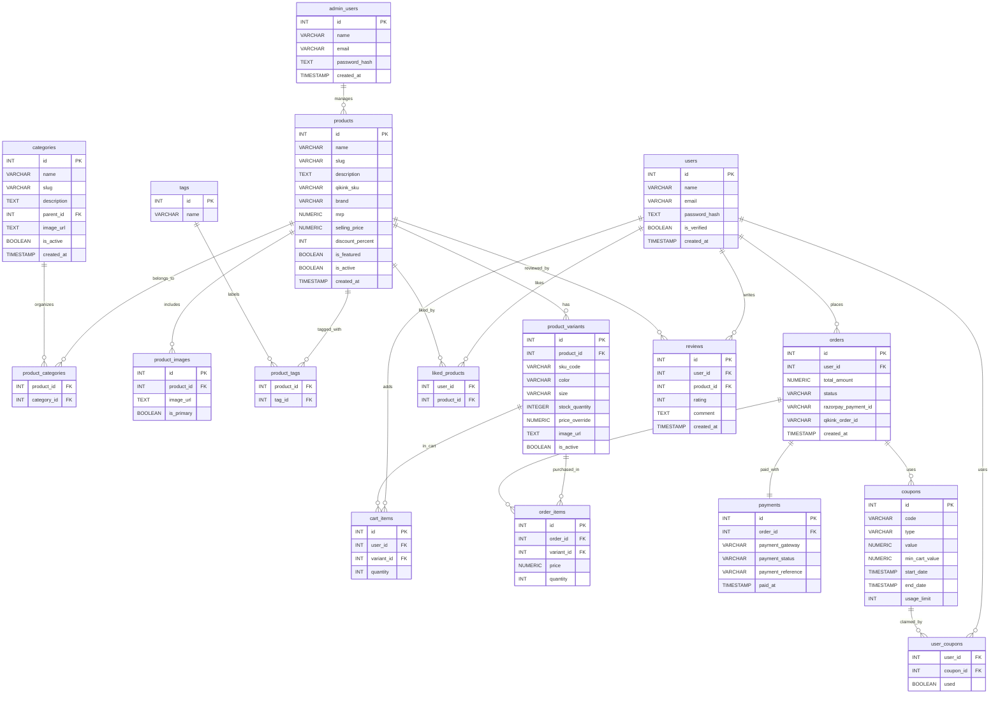

# Database Schema - Urban Fox E-Commerce

## Entity Relationship Diagram

## Database Tables

### Core Entities

#### **users**
Stores authenticated user information (Firebase UIDs)
- Primary authentication via Firebase
- Links to orders, cart, liked products, reviews

#### **admin_users**
Admin user accounts with separate authentication
- Manages products and system administration
- JWT-based authentication

#### **products**
Main product catalog
- Contains pricing, brand, SKU information
- Computed discount percentage
- Links to variants, images, categories, tags

#### **product_variants**
Product variations (size, color combinations)
- Individual SKUs with stock tracking
- Optional price overrides
- Links to cart items and order items

#### **categories**
Hierarchical product categorization
- Self-referencing for parent-child relationships
- Slug-based URLs

#### **product_images**
Product image gallery
- Primary image designation
- Display order

#### **tags**
Product tags for filtering

### Shopping Features

#### **cart_items**
User shopping carts
- Real-time stock validation
- Quantity management

#### **liked_products**
User wishlists/favorites

### Order Management

#### **orders**
Order records
- Payment integration (Razorpay)
- Fulfillment integration (Qikink)
- Order status tracking
- Shipping address stored as JSON

#### **order_items**
Order line items
- Snapshot of product/variant at purchase time
- Historical price records

#### **payments**
Payment transaction records
- Razorpay integration
- Payment status tracking

### Marketing

#### **coupons**
Discount coupons
- Percentage or fixed value
- Usage limits and date ranges

#### **user_coupons**
Coupon usage tracking per user

### Social

#### **reviews**
Product reviews and ratings
- 1-5 star rating system
- Verified purchase flag
- One review per user per product

## Implementation Status

- ✅ Schema created in `complete_schema.sql`
- ✅ All tables with foreign keys and indexes
- ✅ Row Level Security (RLS) policies configured
- ✅ Triggers for auto-updating timestamps

## Related Files

- Database Schema: `complete_schema.sql`
- Setup Guide: `DATABASE_SETUP.md`
- API Documentation: See artifacts in `.gemini/antigravity/brain/`
